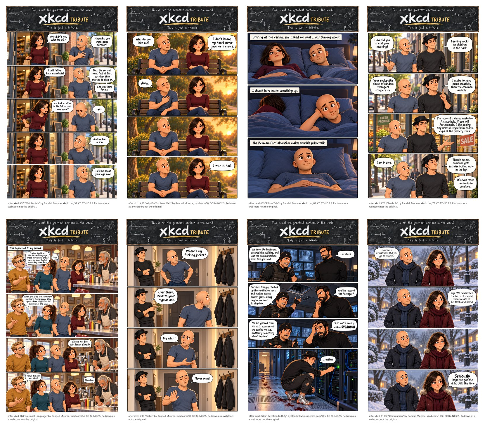
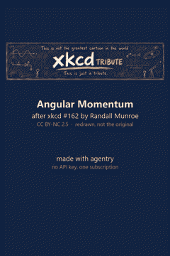

# agentry-demo: eight xkcd strips and one film, redrawn on a subscription

This is [agentry](https://github.com/aweussom/agentry) with a comic
pipeline on the other end of the socket, not a chat window. Eight classic xkcd
strips redrawn as a vertical webtoon with a recurring cast, and one of them
turned into a 40 second film. Every image and every clip was made through
agentry's OpenAI-compatible endpoint on localhost, billed to a subscription I
already had. No API key, except for one clip, and the text says which.

I used two subscriptions, ChatGPT for the strips and SuperGrok for the
film, because I like the look of ChatGPT's images better. That is taste,
not a requirement. One of them does the whole job: Grok draws strips panel
by panel (strip 057 in `striper/` is the proof), and the film needs Grok
because codex has no video tool.





The strips are Randall Munroe's. The dialogue is his, word for word. The
drawings, the cast and the film are mine, made in an evening and a morning. Credit and
licence are in `LICENSE-CONTENT.md` and `prosjekter/xkcd/SOURCES.md`, and in
the footer of every strip. If he objects, it comes down.

## What it proves

1. Drop-in. The pipeline is written against the OpenAI Python SDK. The
   only agentry-specific line is `base_url = http://localhost:8770/v1`. The
   same script runs my own comic against OpenAI's API; for this demo it ran
   against codex and Grok through agentry, and nothing else changed.
2. Continuity. The same five faces in every panel of eight strips and in
   nine key frames of a film. Character cards plus a short canon text sent
   with every request, not luck. The cards are in
   `prosjekter/xkcd/karakterer/`.
3. Two backends, one client. Strips came from codex (gpt-image-2) via
   agentry, about 80 seconds each, seven of eight right on the first run.
   The film's key frames and clips came from Grok Build via agentry. One
   strip, 057, was also made through Grok panel by panel as a comparison;
   it is in `striper/` next to the codex one.

## Numbers

Measured on 6 and 7 October 2026, Windows 11, agentry 0.2.0.

| | codex via agentry | Grok via agentry | xAI API direct |
|---|---|---|---|
| One strip, four to five panels | 75 to 90 s, one call | 2 min 13 s, five calls stitched | not used |
| One key frame, 2:3 | not used | 29 to 56 s | not used |
| One 6 s clip, 480p | not available | 37 to 48 s | 19 s, $0.12 |
| Identity held | 8 of 8 strips | 5 of 5 panels when drawn one at a time; 2 of 4 when asked for a whole strip | same as agentry |

Grok in one call swaps roles between panels. Grok one panel at a time, with
panel 1 as a style reference, does not. `--panels` in `comic.py` does the
one-at-a-time. The whole-strip failure is written up in the tool's TODONT file
so nobody tries it again.

## How it was made

The tool is a snapshot of the one I use for my own comic. It is
project-independent: a project is a folder with a `prosjekt.ini`, canon
text, character cards, and one markdown draft per strip. The script
assembles the prompt, sends the cards, keeps every result with the prompt
that made it, and lets me pick in the browser.

```
python comic.py new prosjekter/xkcd/utkast/058-why-do-you-love-me.md
python comic.py pick prosjekter/xkcd/utkast/058-why-do-you-love-me.md
python comic.py approve prosjekter/xkcd/utkast/058-why-do-you-love-me.md
```

`approve` adds the header and draws the credit footer with Pillow, so the
attribution cannot be mangled by the image model.

For the film:

```
python video.py keyframes prosjekter/xkcd/video/162-angular-momentum.md
python video.py review    prosjekter/xkcd/video/162-angular-momentum.md
python video.py clips     prosjekter/xkcd/video/162-angular-momentum.md
python video.py film      prosjekter/xkcd/video/162-angular-momentum.md
```

The script is in `prosjekter/xkcd/video/`. Nine shots, each with a prompt
for the key frame and one for the movement. Shots without movement become
stills with a slow zoom. The subtitles come out as `.srt` from the same
script.

## Running it yourself

Windows: double-click `install-windows.bat`. It checks for PowerShell 7 and
Python 3.11, offers to install what is missing with winget, then hands off
to `install.ps1`, which does ffmpeg, agentry next to this folder (git
clone, or GitHub's ZIP if there is no git), and a venv. Log in to one
backend once, `grok login` or `codex login`, and double-click `demo.bat`.
It picks grok if that is logged in, else codex, draws strip 058 and opens
the picker. `demo.bat 069-pillow-talk codex` forces a backend.

There is a `keys.ini` in the repo. It has no keys in it. It says which
section is codex and which is Grok, and that agentry lives in `../agentry`.
The full template with the pay-per-image API sections is
`keys.ini.template`.

By hand, any OS: Python 3.11, ffmpeg on the path, agentry cloned next to
this folder and a backend logged in. `pip install -r requirements.txt`
and run the commands above. `--dry-run` on any of them prints the request
as it would go out.

The tool's messages are in Norwegian. The project, the drafts and the canon
are in English. I did not translate the tool for the demo; it is a snapshot.

Draft rules for a strip, learned the hard way: one paragraph per panel,
dialogue in quotes as it should be lettered, state the panel count,
and say who stands on the left. Image models read bubbles top to bottom,
so the first line must sit higher than the reply.

## What did not work

- Grok asked for a whole strip in one call: roles swap between panels.
  Panel by panel fixes it.
- "Counterclockwise" in a video prompt: read both ways. Say "turns toward
  her own left".
- "Turns on the spot": one clip kept the face locked on the camera while
  the body rotated. Say that the face turns away and comes back.
- A key frame of a window alone drew a different window. Say what must not
  be in the frame, or the model fills it from the room reference.

## Credit

Strips after xkcd by Randall Munroe, CC BY-NC 2.5: #57, #58, #69, #72, #84,
#90, #705, #1152, and #162 for the film. See `prosjekter/xkcd/SOURCES.md`.
Redrawn with agentry. Not the originals, not endorsed by xkcd.
